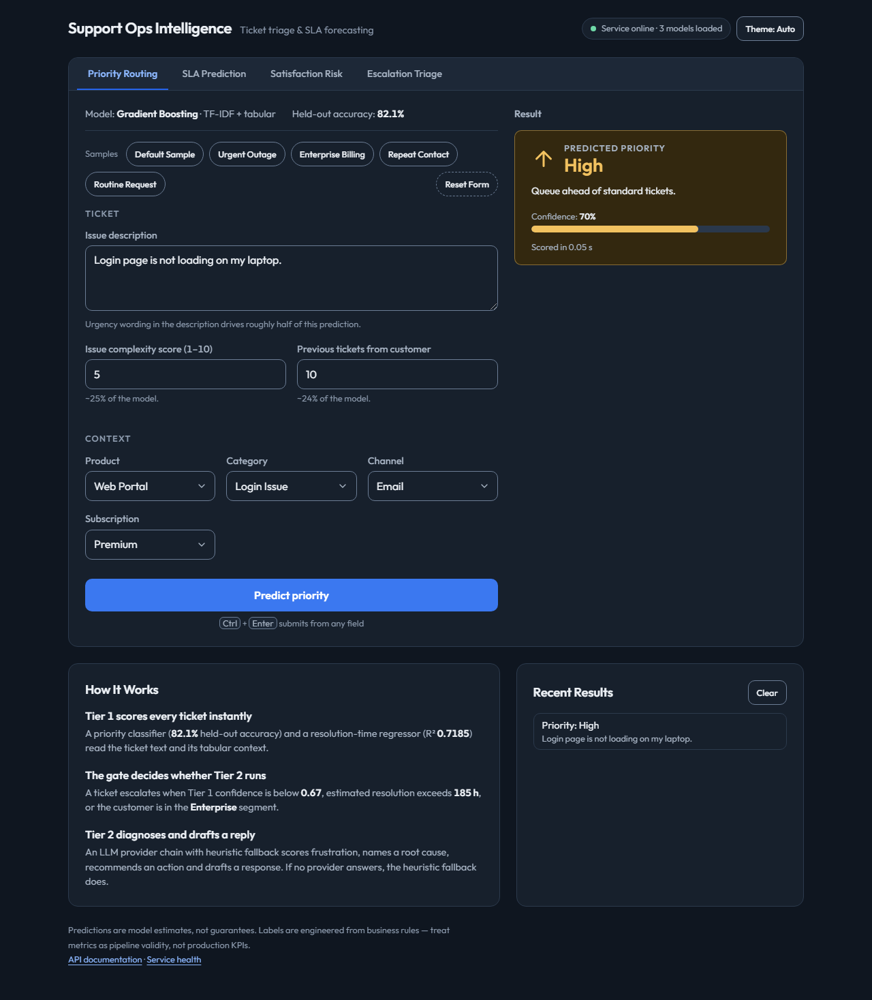
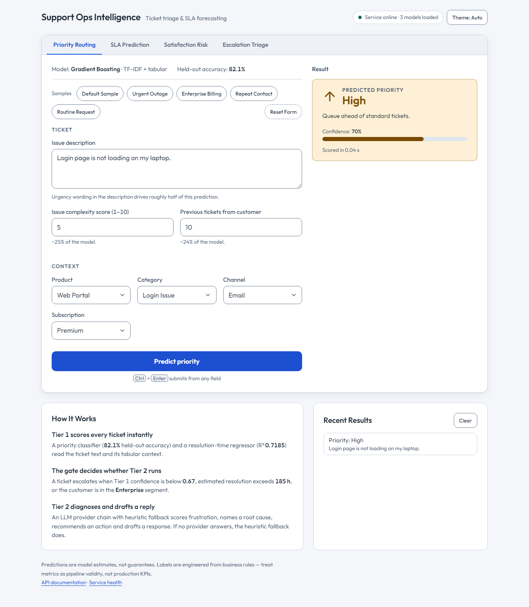
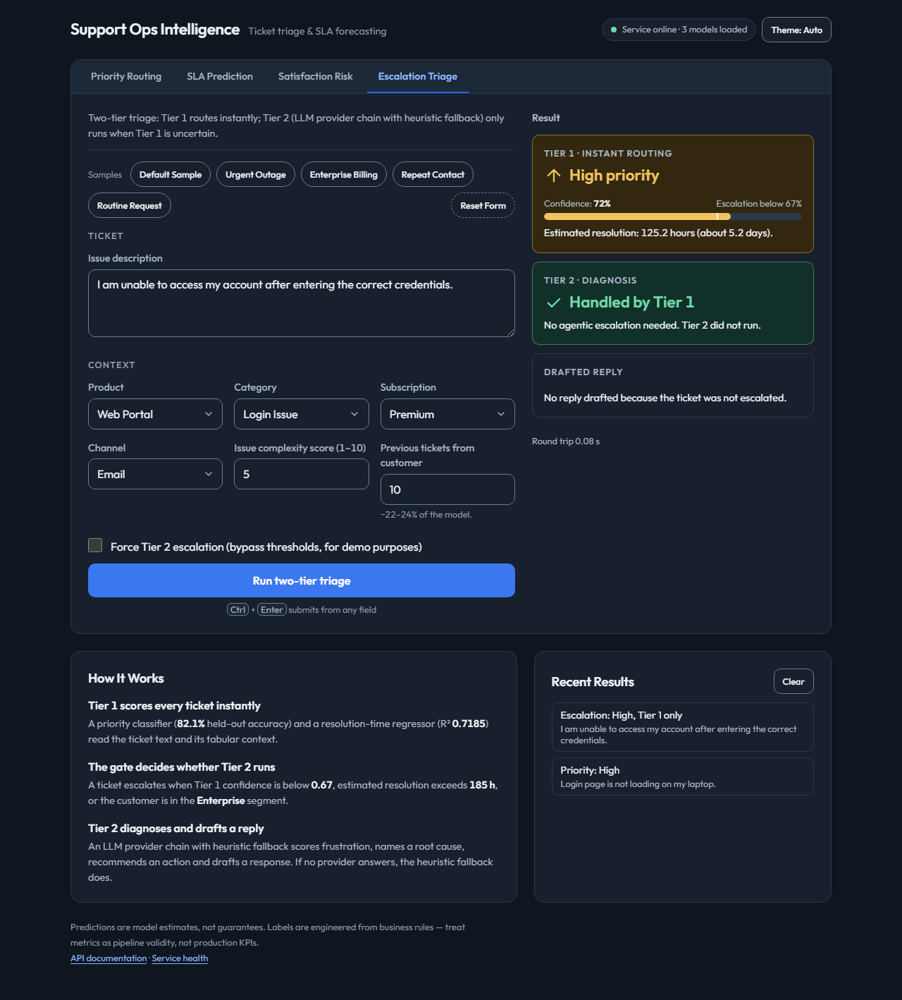
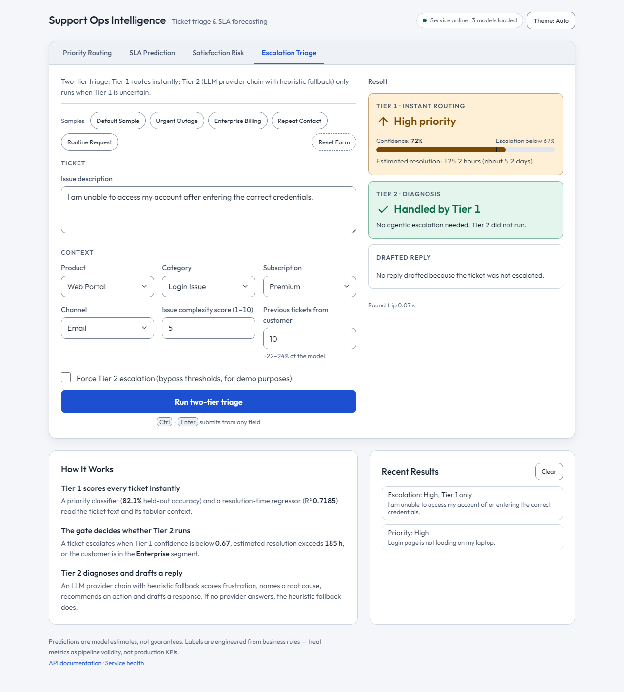
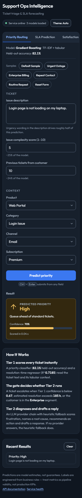
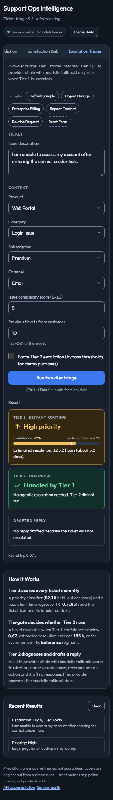

# Customer Support Analytics — Support Ops Intelligence

Machine learning platform that predicts support-ticket priority, resolution time and customer satisfaction, and routes risky tickets to an LLM-based second tier.

Live demo: https://support-ops-api-242711953247.asia-south1.run.app/app

Repository: https://github.com/jegadeesh17/customer-support-ticket-analytics

## Features

- **Priority classification:** multi-class (Urgent, High, Medium, Low) using TF-IDF on `issue_description` plus structured ticket features. Models compared: Logistic Regression, Random Forest, Gradient Boosting and an MLP; class imbalance handled with `class_weight='balanced'` where supported.
- **Resolution time regression:** hours to resolution with leakage columns dropped and a log-transformed target.
- **Customer satisfaction:** Low / Mid / High band from ticket and service attributes.
- **Two-tier triage:** Tier 1 (the sklearn models above) always runs. A rule-based gate sends a ticket to Tier 2 (LLM diagnosis returning a frustration score, root cause, recommended action and a drafted reply) when any of these holds:
  - Tier-1 confidence is below 0.67;
  - predicted resolution is above 185 hours;
  - the subscription is Enterprise and complexity is above 8;
  - the caller passes `force=true` to `POST /triage_agent`.

  Tier 1 handled 69.5% of 1,000 sampled tickets without escalation (`reports/ESCALATION_GATE_BENCHMARK.md`).
- **LLM provider chain:** Groq, then OpenRouter, then OpenAI (first configured key wins). On any error, or with no key, Tier 2 falls back to deterministic heuristics (`triage_source: "heuristic_fallback"`).
- **Interfaces:** FastAPI service with a browser UI at `/app` (tabs: Priority Routing, SLA Prediction, Satisfaction Risk, Escalation Triage) and a three-page Streamlit dashboard.
- **Data:** PostgreSQL is used only by training and data loading (`src/load_data_to_db.py`, `src/data_loader.py`); the API does not use it. EDA plots come from `python src/generate_eda.py`.

## Quick start

Prerequisites: Python 3.11 (CI and the Docker image use 3.11; see Known limitations for 3.13).

```bash
git clone https://github.com/jegadeesh17/customer-support-ticket-analytics.git
cd customer-support-ticket-analytics
python -m venv .venv
source .venv/Scripts/activate          # Windows Git Bash; on Linux/macOS: source .venv/bin/activate
pip install -r requirements-dev.txt    # training, notebooks, DB, API, tests
```

Model files (`.pkl`) are not in git. Either train them or download them:

- Train: put `customer_support_ticket.csv` in `data/` (see [data/DATA_SETUP.md](data/DATA_SETUP.md); without it training uses the 5,000-row sample), then run `python src/train_models.py`.
- Download: set `HF_MODEL_REPO` to a Hugging Face repo that holds the three bundles; they are fetched into `models/` on first use.

Run the services:

```bash
uvicorn api.main:app --port 8002       # API and UI at http://localhost:8002/app
streamlit run app/app.py               # dashboard at http://localhost:8501 (Streamlit default port)
```

## Usage

Endpoints (`api/main.py`):

| Method and path | Purpose |
|---|---|
| `GET /health` | Service status and whether each model file is present |
| `GET /app` | Browser UI |
| `POST /predict_priority` | Priority class |
| `POST /predict_resolution_hours` | Predicted resolution hours |
| `POST /predict_satisfaction` | Satisfaction band |
| `POST /triage_agent?force=false` | Two-tier triage; `force=true` always runs Tier 2 |

Only `issue_description` (at least 5 characters) is required; other `TicketInput` fields have defaults.

```bash
curl -X POST http://localhost:8002/predict_priority \
  -H "Content-Type: application/json" \
  -d '{"issue_description": "Payment failed twice after renewal, account locked."}'
```

Output from a local run:

```json
{"predicted_priority":"Urgent"}
```

`POST /triage_agent` with the same body (local run; the gate did not fire, so the Tier-2 fields are null):

```json
{"ticket_id":null,"tier1_priority":"Urgent","tier1_confidence":0.9613453363641192,"tier1_resolution_hours":158.76311640301444,"escalate_to_tier2":false,"escalation_trigger":null,"tier2_recommends_escalation":null,"customer_frustration_score":null,"root_cause_category":null,"urgency_reasoning":null,"recommended_action":null,"auto_drafted_response":null,"triage_source":null}
```

When Tier 2 runs, `escalation_trigger` is one of `low_confidence`, `severe_resolution`, `high_risk_segment` or `forced`, and the Tier-2 fields are populated. `escalate_to_tier2` is the gate's decision; `tier2_recommends_escalation` is the LLM's own opinion.

## Running tests

```bash
.venv/Scripts/python -m pytest -q                  # full suite
.venv/Scripts/python -m pytest tests/test_triage_gate.py -q   # one file
```

36 tests collected and passing as of 2026-10-03 (`pytest -q` on Python 3.11, 1 deprecation warning from starlette). CI runs the same command (`.github/workflows/ci.yml`).

## Configuration

Copy `.env.example` to `.env`. Variables are read by `configs/settings.py`; all are optional.

| Variable | Purpose | Default |
|---|---|---|
| `DATABASE_URL` | Full Postgres URL (Neon, Supabase); overrides the `DB_*` variables | unset |
| `DB_HOST` | Postgres host | `localhost` |
| `DB_USER` | Postgres user | `postgres` |
| `DB_PASSWORD` | Postgres password (secret) | `postgres` |
| `DB_NAME` | Postgres database | `customer_support_ticket` |
| `DB_PORT` | Postgres port | `5432` |
| `DB_SSLMODE` | Postgres SSL mode | empty |
| `GROQ_API_KEY` | Groq key, primary Tier-2 provider (secret) | unset |
| `GROQ_MODEL` | Groq model for Tier 2 | `openai/gpt-oss-120b` |
| `OPENROUTER_API_KEY` | OpenRouter key, used if no Groq key (secret) | unset |
| `OPENAI_API_KEY` | OpenAI key, used if neither of the above is set (secret) | unset |
| `HF_MODEL_REPO` | Hugging Face repo holding the model bundles | unset |

`.env.example` also lists `API_BASE_URL`, which no code in this repo reads.

## Reproduce The Results

**Dataset source.** The repo does not record where the full dataset came from. `data/DATA_SETUP.md` only says to download it "from your original source (Kaggle or internal export)", with no dataset name or URL, so none is given here.

**Sample vs full data.** The repo ships only `data/customer_support_ticket_sample.csv` (5,000 rows). The headline numbers (~200K tickets, accuracy 0.821, R2 0.7185, 69.5% handled by Tier 1) come from the full ~200,000-row `data/customer_support_ticket.csv`, which is not in git. `src/paths.py` uses the full file when it exists in `data/` and falls back to the sample otherwise, so on a fresh clone the commands below run on the sample and will not reproduce those numbers.

Commands that exist in the repo (run from the project root, after the Quick start setup). I did not run any of them while writing this section, because they overwrite `models/` and `reports/`:

| Step | Command | Run? |
|---|---|---|
| Train the three model bundles into `models/` | `python src/train_models.py` | not run |
| Export metrics to `reports/evaluation.md` and `reports/metrics.json` | `python scripts/export_evaluation.py` | not run |
| Escalation-gate benchmark (writes `reports/ESCALATION_GATE_BENCHMARK.md`) | `python scripts/benchmark_escalation_gate.py` | not run |
| Local inference latency benchmark | `python scripts/benchmark_inference.py --iterations 200 --warmup 10` | not run |

## Screenshots

Captured from the local service at `/app` (Chromium via Playwright, models loaded, no LLM key used, so the Escalation tab shows a Tier-1-only result). Dark and light at 1280 px wide, plus dark at 390 px wide.













## Project structure

```
CustomerSupportAnalytics/
├── .github/workflows/   # ci.yml (tests), deploy.yml (Cloud Run)
├── .streamlit/          # Streamlit theme
├── api/                 # FastAPI app and the /app browser UI
├── app/                 # Streamlit dashboard (app.py, pages/)
├── configs/             # pydantic-settings configuration
├── data/                # sample CSV and DATA_SETUP.md
├── docs/                # specs, deploy guide, decisions, EDA plots
├── models/              # .pkl bundles (not tracked)
├── notebooks/           # 10-step Jupyter notebooks
├── reports/             # evaluation and escalation-gate benchmark
├── scripts/             # benchmarks, evaluation export, Hugging Face upload
├── src/                 # training, inference, triage gate, agent, DB
├── tests/               # pytest suite
├── Dockerfile
├── docker-compose.yml
├── requirements.txt         # Streamlit runtime set
├── requirements-api.txt     # API image set
└── requirements-dev.txt     # training, notebooks, DB, tests
```

## Architecture

```
ticket -> FastAPI -> Tier 1: priority + resolution models (+ satisfaction on its own endpoint)
                      -> escalation gate (src/triage_gate.py)
                           no trigger -> return Tier-1 result
                           trigger or force=true -> Tier 2 (src/agent_triage.py)
                                Groq -> OpenRouter -> OpenAI, 5 s timeout, heuristic fallback
```

Inference builds a full feature row from the user inputs plus defaults so the sklearn pipelines receive the same schema as training. The Docker image (`Dockerfile`) contains `api/`, `src/`, `configs/` and the sample CSV only, with an empty `models/`; Cloud Run downloads the bundles from Hugging Face at runtime. The Streamlit app is not part of that image. Full detail: [docs/SPEC.md](docs/SPEC.md) and [docs/DECISIONS.md](docs/DECISIONS.md).

Deployment: `.github/workflows/deploy.yml` builds the image and deploys Cloud Run service `support-ops-api` in `asia-south1` on every push to `main` and on manual dispatch. See [docs/DEPLOY.md](docs/DEPLOY.md).

## Evaluation

Training samples at most 30,000 rows per task (`TRAIN_SAMPLE` in `src/train_models.py`) and uses an 80/20 split. Metrics from `reports/evaluation.md` (generated by `scripts/export_evaluation.py`):

| Task | Model | Result | Brief target |
|---|---|---|---|
| Priority classification | Gradient Boosting | accuracy 0.821 | >= 0.80 |
| Resolution regression | Random Forest | R2 0.7185 | >= 0.70 |
| Satisfaction classification | Random Forest | accuracy 0.9307 | >= 0.75 |

These are pipeline-validity indicators, not production KPIs, because the labels are engineered (see Known limitations).

Escalation gate: `reports/ESCALATION_GATE_BENCHMARK.md` reports 69.5% of 1,000 tickets handled by Tier 1 (147 `low_confidence`, 140 `severe_resolution`, 18 `high_risk_segment`). The sample uses a different random seed (7) from the one that derived the thresholds (42), but both come from the same CSV.

Latency (local, not production): `scripts/benchmark_inference.py` on a warm Windows laptop process, 200 iterations per model, measured median about 24 ms for classification, about 50 ms for regression and about 50 ms for satisfaction (p95 about 43, 78 and 86 ms). These exclude request overhead and were not measured on Cloud Run; see `docs/SPEC.md` section 4. The Tier-2 latency is not benchmarked.

## Known limitations

- **Engineered labels.** The bundled CSV has weak label signal, so priority, resolution hours and satisfaction labels are derived by deterministic rules plus noise (`src/label_engineering.py`). Metrics are not human-labeled ground truth, and very high scores are expected when features align with the generation rules.
- **Satisfaction-model leakage.** The satisfaction label is derived from `first_response_time_hours`, `issue_complexity_score`, `previous_tickets` and `sla_breached` (`src/label_engineering.py:74-92`), and the satisfaction model keeps `first_response_time_hours`, `escalated` and `sla_breached` as input features (`src/preprocessor.py:22`). The 0.9307 accuracy partly measures how well the model recovers the labelling rule.
- **Regression label shares signal with features.** Regression training drops `resolution_time_hours`, `ticket_id` and `first_response_time_hours`, but the engineered resolution label (`src/label_engineering.py:51-71`) is built from a text-derived priority, `issue_complexity_score`, `previous_tickets` and description length, which the model can see as features (including `text_urgency_score` and `desc_length`).
- **Groq model default changed, not yet verified live.** `llama-3.3-70b-versatile` is deprecated on Groq, so the `GROQ_MODEL` default is now `openai/gpt-oss-120b` (see `docs/DECISIONS.md` ADR-05). The provider is chosen once, by the first API key that is set (Groq, then OpenRouter, then OpenAI); there is no failover between providers. If the Groq call fails, Tier 2 falls back straight to heuristics (`triage_source: "heuristic_fallback"`).
- **No Tier-2 retry and no circuit breaker.** One 5 s attempt per request, then heuristics (`src/agent_triage.py:184-194`).
- **Streamlit is not deployed with the API.** The Cloud Run image does not include `app/`.
- **Sample data.** The repo ships a 5,000-row sample; the full 200,000-row, 30-column dataset is local only. If the full file is present, training and the gate benchmark use it instead.
- **`docker-compose.yml` starts Postgres for the API service,** which does not use a database; it also passes `OPENROUTER_API_KEY` but not `GROQ_API_KEY`.
- **Python 3.13.** `pip install -r requirements-dev.txt` failed on Python 3.13 (Windows) while building `psycopg2` from source; use Python 3.11, as CI does.
- **Deploys on every push to `main`.** There is no path filter, so documentation-only pushes redeploy.

## Documentation

- [docs/README.md](docs/README.md): index of all documents
- [docs/DECISIONS.md](docs/DECISIONS.md): architecture decision records
- [CHANGELOG.md](CHANGELOG.md): notable `feat:` and `fix:` changes (earlier commits without those prefixes are not listed)
- [docs/SPEC.md](docs/SPEC.md): technical specification
- [docs/DEPLOY.md](docs/DEPLOY.md) and [docs/DEMO.md](docs/DEMO.md): deployment and demo walkthroughs

## License

MIT. See [LICENSE](LICENSE).
